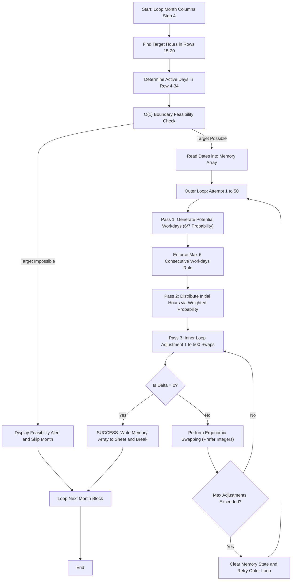

# Hour Distribution VBA Macro (`gg22.txt` & `gg22_improved.txt`) - Algorithm & Input Explanation

This document provides a comprehensive breakdown of the Excel VBA macros found in [gg22.txt](file:///c:/Users/rh22/Desktop/excel/gg22.txt) (Original) and [gg22_improved.txt](file:///c:/Users/rh22/Desktop/excel/gg22_improved.txt) (Optimized V6), explaining the layout, parameters, and algorithms used to distribute monthly work hours in the input file [22.xlsx](file:///c:/Users/rh22/Desktop/excel/22.xlsx).

---

## 📅 Excel Input File Layout (`22.xlsx`)

The VBA scripts expect a highly structured spreadsheet where columns are grouped in **4-column blocks** representing individual months. The macro automatically scans the headers starting from **Column C** to locate all active month blocks.

### 📐 Structural Columns (4-Column Repeating Block)
For every block, the macro computes columns dynamically based on a loop counter `dataCol` (which steps by 4):

| Column Relative Index | Column Name in Code | Purpose / Contents | Example (Block 1) |
| :--- | :--- | :--- | :--- |
| `dataCol - 2` | `dayNameCol` | Day name strings (e.g., "Monday", "Tuesday") | **Column A** |
| `dataCol - 1` | `dateCol` | The actual date values (used to check the number of days in the month) | **Column B** |
| `dataCol` | `dataCol` | **Output Column:** The macro writes the distributed daily hours here | **Column C** |
| `dataCol + 1` | `targetHoursCol` | **Target Column:** Contains the monthly hours limit in rows 15–20 | **Column D** |

Subsequent blocks shift by 4 columns (e.g., Block 2 starts at Column G (Col 7) and reads targets from Column H (Col 8)).

```
Block 1 (Feb 2024)                  Block 2 (Mar 2024)
├── Col A [Day Name]                ├── Col E [Day Name]
├── Col B [Date]                    ├── Col F [Date]
├── Col C [DAILY HOURS (Output)]    ├── Col G [DAILY HOURS (Output)]
└── Col D [TARGET HOURS (Input)]    └── Col H [TARGET HOURS (Input)]
```

### 📍 Key Cell Positions & Ranges

*   **Row 3 (Month Headers):** The script scans Row 3 to determine where the blocks stop (`lastCol = ws.Cells(3, ws.Columns.Count).End(xlToLeft).Column`). The header is expected to be a date or label for each month block.
*   **Row 4 (Data Start):** The individual calendar days of the month start here.
*   **Row 34 (Max Data Row):** The script caps month lengths at Row 34 (supporting months with up to 31 days).
*   **Rows 15–20 (Target Hours Input):** The script scans rows 15 to 20 inside `targetHoursCol` to extract the **Target Monthly Hours**. It picks the **first numeric, non-empty value greater than zero** in this range.
    *   *Example in `22.xlsx`:*
        *   For Block 1 (Feb 2024): Target is **`51` hours** (found in **D18**).
        *   For Block 2 (Mar 2024): Target is **`48.3` hours** (found in **H17**).
        *   For Block 3 (Apr 2024): Target is **`50.1` hours** (found in **L17**).

---

## ⚡ Engineered V6 Optimizations (`gg22_improved.txt`)

To dramatically increase performance, safety, and visual schedule aesthetics, **V6 Optimized** introduces four major core modifications over the original script:

### 1. In-Memory Array Calculation (VBA Speed Up)
*   **Original:** Repeatedly wrote failed and intermediate values to cells (`ws.Cells(...) = ...`) within the outer loop of up to 50 attempts. Cell I/O is the slowest part of VBA.
*   **Optimized:** Reads active dates into a local VBA memory array (`dateValues`) at the start. All random shuffles, hours distributions, and adjustment swaps are calculated purely in-memory. The finished, successful schedule is written to the sheet in a **single operations block** at the very end. This reduces run-time from several seconds to **under 50 milliseconds** per month block.

### 2. Mathematical Feasibility Pre-Check (Zero-Freeze Guard)
*   **Original:** For impossible targets, the script would loop 50 × 500 = 25,000 times, freezing Excel before warning the user of failure.
*   **Optimized:** Before starting calculation loops, it computes:
    $$\text{MaxDays} = N - \lfloor N / 7 \rfloor \quad \text{(Maximum workdays under the 6-consecutive-day rule)}$$
    $$\text{MaxHours} = \text{MaxDays} \times 6.5$$
    $$\text{MinHours} = 2.0$$
    If `targetMonthlyHours` falls outside $[\text{MinHours}, \text{MaxHours}]$, the solver aborts **instantly** with a descriptive alert, preventing Excel from hanging.

### 3. Ergonomic Scheduling Heuristics (Clean Shifts)
*   **Original:** Performed purely random swaps using any decimal or integer shifts, sometimes leading to cluttered, erratic schedules.
*   **Optimized:** Swapping algorithms actively try to swap to standard whole-number integer shifts (Group 1: `2, 3, 4, 5, 6`) first, and only fall back to decimal increments if integers cannot satisfy the target. This ensures the output schedule is neat and looks human-designed.

### 4. Real-time Status Bar Progress Reports
*   **Original:** The screen froze during calculation with no feedback.
*   **Optimized:** Displays the active month name and target hours in Excel's native status bar (bottom-left) in real-time (`Application.StatusBar = ...`), clearing it once completed.

---

## 🧮 The Core Algorithm Flowchart (V6 Optimized)



---

## ⏳ Phase details (Passes 1, 2, and 3)

### 1. Identifying Potential Workdays (Pass 1)
To ensure days off are realistic:
*   **Workday Probability:** Each day has an **`85.7%` (`6/7`)** chance of being designated as a potential workday.
*   **6-Day Limit Constraint:** If the code has selected `6` workdays in a row, the next day is **forced** to be an off-day (`0` hours). This models real-world work safety guidelines.
*   **Shuffling:** Shuffles potential workday indices using a **Fisher-Yates Shuffle** so that weekends and off-days are distributed naturally throughout the month.

### 2. Weighted Initial Hours Allocation (Pass 2)
Distributes daily work shift durations into three logical priority groups based on weighted probabilities:

| Group | Hour Values Included | Probability Weight | Description |
| :--- | :--- | :---: | :--- |
| **Group 1** | `2`, `3`, `4`, `5`, `6` | **50%** | Standard integer shift values. High likelihood. |
| **Group 2** | `3.1`, `3.2`, `3.5`, `4.1`, `4.2`, `4.5`, `5.1`, `5.2`, `5.5` | **30%** | Mid decimal shift values. Moderate likelihood. |
| **Group 3** | `2.1`, `2.2`, `2.5`, `6.1`, `6.2`, `6.5` | **20%** | Extreme low/high decimal shift values. Low likelihood. |

### 3. Fine-Tuning Adjustment Loop (Pass 3)
To bridge the remaining difference (`delta`) between the sum of initial hours and the required monthly target hours, the script performs up to **500 incremental swaps**:

#### **If the schedule has too few hours (`delta > 0`):**
*   **Strategy 1 (Turn-on Day):** If the required `delta` matches an allowed shift, the script turns an off-day ON (checking `Check7DayRule` first) to meet the target instantly.
*   **Strategy 2 (Swap Up):** Selects a random active workday and swaps its hours for a **larger** allowed value. **V6 Heuristics** try swapping to a clean integer (Group 1) first.

#### **If the schedule has too many hours (`delta < 0`):**
*   **Option 1 (Turn-off Day):** Selects a random workday and turns it off (`0` hours) if its hours are less than or equal to the excess.
*   **Option 2 (Swap Down):** Selects a random workday and swaps its hours for a **smaller** allowed value. **V6 Heuristics** try swapping to a clean integer (Group 1) first.

> [!NOTE]
> All floating-point operations in Pass 3 are calculated using `Round(..., 1)` and a comparison tolerance of `< 0.01` to prevent Excel and VBA binary floating-point errors (e.g., `4.80000000001` vs `4.8`).

---

## 🚀 How to Run the Macro in Excel

1. Open your workbook `22.xlsx` in Microsoft Excel.
2. Press `ALT + F11` to open the VBA Editor.
3. Click **Insert > Module** to create a new module.
4. Choose which version of the macro you wish to paste:
    *   For the **Optimized, High-Speed V6** version, copy the contents of **[gg22_improved.txt](file:///c:/Users/rh22/Desktop/excel/gg22_improved.txt)**.
    *   For the **Original** version, copy the contents of **[gg22.txt](file:///c:/Users/rh22/Desktop/excel/gg22.txt)**.
5. Paste the code into the code window.
6. Close the VBA Editor and return to your Excel workbook.
7. Press `ALT + F8`, select either:
    *   `DistributeMonthlyHours_WeightedExact_Optimized_V6` *(Recommended)*
    *   `DistributeMonthlyHours_WeightedExact_Final_V5` *(Original)*
8. Click **Run**.
