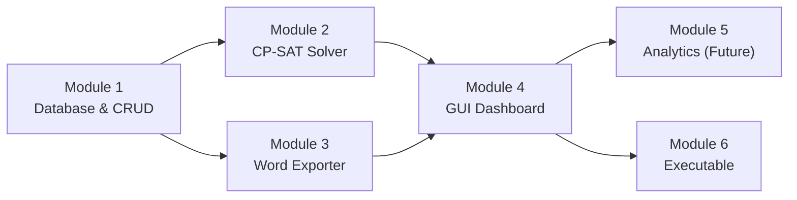

# Phase 4: Implementation Roadmap

Each module is isolated and testable. Complete and verify each before moving to the next. No module depends on a later one.

---

## Dependency Graph

---

## Module 1: Database & CRUD Layer

**Files:**
- `[NEW]` [utils/paths.py](file:///c:/Users/rh22/Desktop/excel/utils/paths.py)
- `[NEW]` [db/__init__.py](file:///c:/Users/rh22/Desktop/excel/db/__init__.py)
- `[NEW]` [db/database.py](file:///c:/Users/rh22/Desktop/excel/db/database.py)
- `[NEW]` [db/models.py](file:///c:/Users/rh22/Desktop/excel/db/models.py)
- `[NEW]` [tests/test_database.py](file:///c:/Users/rh22/Desktop/excel/tests/test_database.py)

**Dependencies:** None (first module)

### Task 1.1 — Path Utility
| | |
|---|---|
| **File** | `utils/paths.py` |
| **What** | `get_base_directory()` function + `DB_PATH` constant. Handles frozen `.exe` vs script mode. |
| **Acceptance** | Importing `DB_PATH` returns a path ending in `timesheets.db` relative to the project root. |
| **Complexity** | Trivial |

### Task 1.2 — Schema Initialization
| | |
|---|---|
| **File** | `db/database.py` |
| **What** | `get_connection()` and `initialize_database()`. Creates 4 tables with exact DDL from Phase 3 §2.3. Every connection sets `PRAGMA foreign_keys = ON`. |
| **Acceptance** | Calling `initialize_database()` creates a `.db` file with all 4 tables. Re-calling is idempotent (`CREATE TABLE IF NOT EXISTS`). |
| **Complexity** | Low |

### Task 1.3 — CRUD Functions
| | |
|---|---|
| **File** | `db/models.py` |
| **What** | All CRUD functions from Phase 3 §5.2: Cities (add/get/update/delete), Employees (add/get/update/delete), Timesheets (create/get/get_with_entries/save_entries/update_status/set_lock/delete), Solver support queries (prev_month_boundary, cross_city_active_days, city_coverage), Backup/Restore. |
| **Acceptance** | Each function works in isolation against a test DB. |
| **Complexity** | Medium |

### Task 1.4 — Database Tests
| | |
|---|---|
| **File** | `tests/test_database.py` |
| **What** | Unit tests covering: basic CRUD for all 3 entities, uniqueness constraint violation on duplicate timesheet, cascade-block on city/employee deletion with existing timesheets, cascade delete of daily_entries when timesheet deleted, prev_month_boundary returns `[0]*6` when no data, backup/restore round-trip. |
| **Acceptance** | All tests pass with `pytest`. |
| **Complexity** | Medium |

### ✅ Module 1 Checkpoint
Run `pytest tests/test_database.py` — all pass. Database file creates cleanly, CRUD works, constraints enforced.

---

## Module 2: CP-SAT Hour Distribution Solver

**Files:**
- `[NEW]` [solver/__init__.py](file:///c:/Users/rh22/Desktop/excel/solver/__init__.py)
- `[NEW]` [solver/sat_solver.py](file:///c:/Users/rh22/Desktop/excel/solver/sat_solver.py)
- `[NEW]` [tests/test_solver.py](file:///c:/Users/rh22/Desktop/excel/tests/test_solver.py)

**Dependencies:** Module 1 (reads from DB via `models.py`)

### Task 2.1 — Data Structures & Scaling
| | |
|---|---|
| **File** | `solver/sat_solver.py` |
| **What** | Define `SolverInput`, `SolverResult`, `DriverSpec`, `DayEntry` dataclasses. Implement `hours_to_units()` / `units_to_hours()` / `clock_to_units()` / `units_to_clock()` conversion helpers. Define `ALLOWED_SHIFTS = {4,5,6,7,8,9,10,11,12,13,14,15,16}`. |
| **Acceptance** | `hours_to_units(6.5)` → `13`. `units_to_clock(44)` → `"22:00"`. Round-trip conversions are lossless. |
| **Complexity** | Low |

### Task 2.2 — Core Solver (Single Driver, No Staggering)
| | |
|---|---|
| **File** | `solver/sat_solver.py` |
| **What** | Build the CP-SAT model for a single driver: variables (active, hours, start, break, end), hard constraints C1–C6 from Phase 3 §3.3. No objective function yet — just feasibility. |
| **Acceptance** | Given a 30-day month, target=80h, city 08:00–22:00: solver returns a valid schedule where `sum(hours) == 80.0`, no shift < 2.0 or > 8.0, breaks applied correctly, max 6 consecutive days. |
| **Complexity** | High |

### Task 2.3 — Consecutive Day Boundaries
| | |
|---|---|
| **File** | `solver/sat_solver.py` |
| **What** | Integrate `prev_month_boundary` (6 fixed values prepended) and `cross_city_active_days` (merged into active array) into the sliding window constraint. |
| **Acceptance** | If prev_month last 6 days = `[1,1,1,1,1,1]`, solver forces day 1 of current month to be off. If cross-city has day 10 active, solver counts it in the consecutive window. |
| **Complexity** | Medium |

### Task 2.4 — Objective Function
| | |
|---|---|
| **File** | `solver/sat_solver.py` |
| **What** | Add half-hour penalty ($\alpha=1$) and overlap/staggering penalty ($\beta=10$). Implement both batch (minimize peak coverage) and incremental (minimize overlap with fixed coverage) formulations from Phase 3 §3.4. |
| **Acceptance** | With 3 drivers in batch mode on a 14-hour city window, start times are visibly spread across the window rather than clustered. Integer shifts are preferred over half-hour shifts when target allows it. |
| **Complexity** | High |

### Task 2.5 — Two-Phase Solve
| | |
|---|---|
| **File** | `solver/sat_solver.py` |
| **What** | Implement Phase A (exact) → Phase B (nearest feasible) fallback from Phase 3 §3.5. Wire both into the `solve()` entry point. Set time limits (30s per phase). |
| **Acceptance** | For an intentionally tight scenario (e.g., target slightly above max), Phase A fails and Phase B returns a result with `status='nearest'` and a nonzero `target_deviation`. |
| **Complexity** | Medium |

### Task 2.6 — Batch vs Incremental Modes
| | |
|---|---|
| **File** | `solver/sat_solver.py` |
| **What** | `mode='batch'` solves all drivers simultaneously. `mode='incremental'` solves one driver against fixed others. Locked timesheets are loaded as read-only in both modes. |
| **Acceptance** | Batch with 3 drivers produces 3 schedules. Incremental with 1 driver + 2 existing produces 1 schedule that avoids their slots. Locked timesheets are never modified. |
| **Complexity** | Medium |

### Task 2.7 — Solver Tests
| | |
|---|---|
| **File** | `tests/test_solver.py` |
| **What** | Tests for: exact target match, break application at 6.5h threshold, 6-consecutive-day enforcement, cross-month boundary, cross-city consecutive days, half-hour minimization preference, nearest-feasible fallback, batch staggering produces spread-out starts, locked entries remain unchanged. |
| **Acceptance** | All tests pass. No test takes > 60 seconds. |
| **Complexity** | Medium |

### ✅ Module 2 Checkpoint
Run `pytest tests/test_solver.py` — all pass. Manually inspect a sample 3-driver batch output to confirm staggering visually.

---

## Module 3: Word Document Exporter

**Files:**
- `[NEW]` [exporter/__init__.py](file:///c:/Users/rh22/Desktop/excel/exporter/__init__.py)
- `[NEW]` [exporter/docx_exporter.py](file:///c:/Users/rh22/Desktop/excel/exporter/docx_exporter.py)
- `[NEW]` [tests/test_exporter.py](file:///c:/Users/rh22/Desktop/excel/tests/test_exporter.py)

**Dependencies:** Module 1 (reads timesheet data from DB)

### Task 3.1 — Exporter Class
| | |
|---|---|
| **File** | `exporter/docx_exporter.py` |
| **What** | `generate_docx()` function per Phase 3 §5.4. Port the document styling from [generate_timesheet.py L280–409](file:///c:/Users/rh22/Desktop/excel/generate_timesheet.py#L280-L409) (title, metadata block, table, summary, footer). Key changes from legacy: (1) `Arbeitsbeginn`/`Arbeitsende`/`Pause` columns are **filled from data**, not blank. (2) City comes from function parameter (sourced from TIMESHEET's city). (3) No `"Wochenende"` labels. (4) German formatting for all values. |
| **Acceptance** | Given sample daily entries with hours, start/end times, and breaks, produces a `.docx` file with all columns populated. Open in Word and visually verify. |
| **Complexity** | Medium |

### Task 3.2 — Exporter Tests
| | |
|---|---|
| **File** | `tests/test_exporter.py` |
| **What** | Generate a test document with known data. Verify: file exists, file is a valid `.docx` (can be opened by python-docx), table has correct number of rows (header + days in month), summary line shows correct total. |
| **Acceptance** | All tests pass. |
| **Complexity** | Low |

### ✅ Module 3 Checkpoint
Run `pytest tests/test_exporter.py` — all pass. Open a generated `.docx` in Word and visually confirm formatting.

---

## Module 4: GUI Dashboard

**Files:**
- `[NEW]` [ui/__init__.py](file:///c:/Users/rh22/Desktop/excel/ui/__init__.py)
- `[NEW]` [ui/main_gui.py](file:///c:/Users/rh22/Desktop/excel/ui/main_gui.py)
- `[MODIFY]` [generate_timesheet.py](file:///c:/Users/rh22/Desktop/excel/generate_timesheet.py)

**Dependencies:** Modules 1, 2, 3

### Task 4.1 — Application Shell & Tab Layout
| | |
|---|---|
| **File** | `ui/main_gui.py` |
| **What** | Tkinter TTK root window with `ttk.Notebook` containing 3 tabs: "Cities", "Drivers", "Timesheets". Add a top menu bar with **Tools → Backup / Restore**. Apply professional styling (Segoe UI font, clam theme, color palette from legacy code). |
| **Acceptance** | App launches, 3 tabs are visible and switchable, Tools menu is accessible. |
| **Complexity** | Low |

### Task 4.2 — Cities Tab
| | |
|---|---|
| **File** | `ui/main_gui.py` |
| **What** | Treeview table listing all cities (Name, Start Time, End Time). Add/Edit/Delete buttons. Add opens a dialog for name + start/end times. Delete checks for referential integrity and shows error if blocked. |
| **Acceptance** | Can add a city, see it in the list, edit it, and delete it (only if no timesheets reference it). |
| **Complexity** | Medium |

### Task 4.3 — Drivers Tab
| | |
|---|---|
| **File** | `ui/main_gui.py` |
| **What** | Treeview table listing all drivers (Name, Personal ID). Add/Edit/Delete buttons. Delete blocked if timesheets exist for the driver. |
| **Acceptance** | Can add, edit, delete drivers. Deletion correctly blocked when timesheets reference the driver. |
| **Complexity** | Medium |

### Task 4.4 — Timesheets Tab (List & Create)
| | |
|---|---|
| **File** | `ui/main_gui.py` |
| **What** | Treeview table listing timesheets with columns: Driver Name, City, Month/Year, Target Hours, Status, Locked. Filter dropdowns for city and month. "New Timesheet" button opens a creation dialog (select driver, city, month/year, target hours). Validates: future/current month only, target in `[10.0, max]` and multiple of 0.5, no duplicate. |
| **Acceptance** | Can create a timesheet. Past months rejected. Duplicates rejected. List refreshes correctly. |
| **Complexity** | Medium |

### Task 4.5 — Solver Integration (Distribute Hours)
| | |
|---|---|
| **File** | `ui/main_gui.py` |
| **What** | Two buttons: "Distribute (Single)" and "Distribute All (City Batch)". Single shows incremental warning → confirmation → runs solver in background thread → shows result in grid. Batch runs for all Draft, non-locked timesheets in selected city/month. Re-generation prompts overwrite confirmation. Solver logs displayed in a collapsible log panel. Nearest-feasible result shows accept/reject dialog. |
| **Acceptance** | Single and batch distribution work. Incremental warning appears. Overwrite confirmation appears. Nearest-feasible dialog appears when triggered. UI doesn't freeze during solve. |
| **Complexity** | High |

### Task 4.6 — Editable Grid Preview
| | |
|---|---|
| **File** | `ui/main_gui.py` |
| **What** | After solver runs (or when viewing an existing timesheet), show an editable grid: Date, Start, End, Break, Hours, Remarks. User can click cells to edit. On save, prompt: "Apply to all workers?" / "Lock this driver only?". Soft validation warnings for constraint violations (totals, consecutive days, shift bounds, city window). |
| **Acceptance** | Can edit a cell, save, see the prompt, choose lock or redistribute. Warnings appear for invalid values but don't block saving. |
| **Complexity** | High |

### Task 4.7 — Finalize / Revert / Export
| | |
|---|---|
| **File** | `ui/main_gui.py` |
| **What** | "Finalize" button sets status to Finalized (blocks re-solving). "Revert to Draft" button reverses it. "Export to Word" button calls `generate_docx()` with save-as dialog, works for both Draft and Finalized. |
| **Acceptance** | Finalized timesheet cannot be re-solved. Reverted timesheet can. Export produces correct `.docx`. |
| **Complexity** | Low |

### Task 4.8 — Backup & Restore
| | |
|---|---|
| **File** | `ui/main_gui.py` |
| **What** | Tools → Backup: file save dialog → copies DB. Tools → Restore: file open dialog → confirmation prompt → replaces DB → refreshes all views. |
| **Acceptance** | Backup creates a valid copy. Restore replaces DB and UI reflects the restored data. |
| **Complexity** | Low |

### Task 4.9 — Entry Point Update
| | |
|---|---|
| **File** | `generate_timesheet.py` |
| **What** | Replace legacy GUI and CLI code. New `main()`: calls `initialize_database()`, launches `main_gui.py` dashboard. Preserve CLI `--help` for reference but all functionality is now GUI. |
| **Acceptance** | Running `python generate_timesheet.py` opens the new dashboard. DB initializes on first run. |
| **Complexity** | Low |

### ✅ Module 4 Checkpoint
Full manual walkthrough: add a city → add 3 drivers → create timesheets → batch distribute → preview grid → edit one driver → lock → re-batch (locked driver untouched) → finalize → export to Word → backup → delete all → restore → data is back.

---

## Module 5: Analytics (Future — Deferred)

**Files:**
- `[NEW]` `ui/analytics_tab.py`

### Task 5.1 — Analytics Tab with Matplotlib
| | |
|---|---|
| **What** | Add a 4th tab "Analytics" to the notebook. Embed matplotlib charts: driver hours bar chart, city coverage heatmap. |
| **Complexity** | Medium |
| **Status** | **Deferred to post-launch iteration** |

---

## Module 6: Windows Executable

**Files:**
- `[NEW]` `build.bat` or `build.ps1`

### Task 6.1 — PyInstaller Configuration
| | |
|---|---|
| **What** | `pyinstaller --onefile --windowed --name="TimesheetSystem" --collect-all ortools generate_timesheet.py` |
| **Acceptance** | `.exe` launches from any directory. DB file created next to `.exe`. All features work. |
| **Complexity** | Medium (OR-Tools bundling can be tricky) |

### ✅ Module 6 Checkpoint
Copy `.exe` to a clean folder → run → add a city → distribute → export. DB file appears next to `.exe`.

---

## Implementation Order Summary

| Order | Module | Tasks | Est. Files | Risk |
|---|---|---|---|---|
| 1 | Database & CRUD | 1.1–1.4 | 5 | Low |
| 2 | CP-SAT Solver | 2.1–2.7 | 3 | **High** (core complexity) |
| 3 | Word Exporter | 3.1–3.2 | 3 | Low |
| 4 | GUI Dashboard | 4.1–4.9 | 3 | **High** (UX complexity) |
| 5 | Analytics | 5.1 | 1 | Low (deferred) |
| 6 | Executable | 6.1 | 1 | Medium |

> [!IMPORTANT]
> **Module 2 (Solver) is the highest-risk component.** It contains the core CP-SAT constraint model, the two-phase strategy, and both batch/incremental modes. I recommend extra attention and testing here. If any task needs to be split further during implementation, it's the solver tasks.
