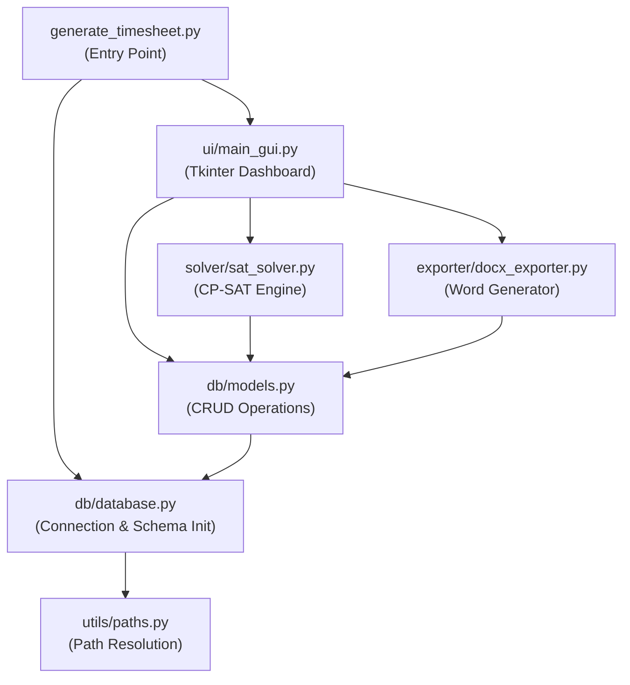
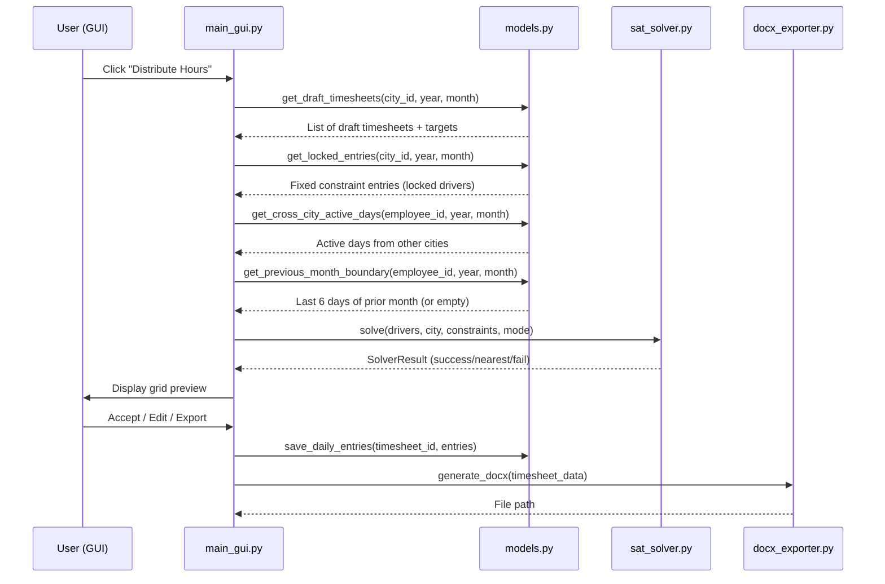

# Phase 3: Architectural Blueprint & Edge-Case Map

---

## 1. System Architecture

### Module Dependency Graph



### Data Flow (Generate Timesheet)



---

## 2. Database Safety Measures

### 2.1 Transaction Pattern

All write operations use explicit transactions. Every CRUD function that modifies data follows:

```python
def example_write(db_path, ...):
    conn = sqlite3.connect(db_path)
    conn.execute("PRAGMA foreign_keys = ON")  # MUST be set per-connection
    try:
        with conn:  # auto-commit on success, auto-rollback on exception
            conn.execute("INSERT INTO ...")
    finally:
        conn.close()
```

> [!IMPORTANT]
> SQLite foreign keys are **off by default**. Every connection must execute `PRAGMA foreign_keys = ON` before any operation. This is the mechanism that enforces cascade-block on deletion.

### 2.2 Deletion Integrity

| Entity | Deletion Behavior | Implementation |
|---|---|---|
| **CITY** | **Blocked** if any TIMESHEET references `city_id` | `ON DELETE RESTRICT` on FK |
| **EMPLOYEE** | **Blocked** if any TIMESHEET references `employee_id` | `ON DELETE RESTRICT` on FK |
| **TIMESHEET** | **Cascades** to delete all DAILY_ENTRY rows | `ON DELETE CASCADE` on FK |
| **DAILY_ENTRY** | Direct delete, no dependencies | Simple DELETE |

### 2.3 Schema DDL

```sql
CREATE TABLE IF NOT EXISTS city (
    id          INTEGER PRIMARY KEY AUTOINCREMENT,
    name        TEXT NOT NULL UNIQUE,
    start_time  TEXT NOT NULL DEFAULT '08:00',
    end_time    TEXT NOT NULL DEFAULT '22:00'
);

CREATE TABLE IF NOT EXISTS employee (
    id          INTEGER PRIMARY KEY AUTOINCREMENT,
    name        TEXT NOT NULL,
    personal_id TEXT NOT NULL
);

CREATE TABLE IF NOT EXISTS timesheet (
    id                      INTEGER PRIMARY KEY AUTOINCREMENT,
    employee_id             INTEGER NOT NULL,
    city_id                 INTEGER NOT NULL,
    year                    INTEGER NOT NULL,
    month                   INTEGER NOT NULL,
    target_hours            REAL NOT NULL,
    status                  TEXT NOT NULL DEFAULT 'Draft' CHECK(status IN ('Draft', 'Finalized')),
    is_distribution_locked  INTEGER NOT NULL DEFAULT 0,
    FOREIGN KEY (employee_id) REFERENCES employee(id) ON DELETE RESTRICT,
    FOREIGN KEY (city_id) REFERENCES city(id) ON DELETE RESTRICT,
    UNIQUE(employee_id, year, month, city_id)
);

CREATE TABLE IF NOT EXISTS daily_entry (
    id              INTEGER PRIMARY KEY AUTOINCREMENT,
    timesheet_id    INTEGER NOT NULL,
    work_date       TEXT NOT NULL,
    hours_worked    REAL NOT NULL DEFAULT 0.0,
    start_time      TEXT,
    end_time        TEXT,
    break_duration  TEXT,
    remarks         TEXT,
    FOREIGN KEY (timesheet_id) REFERENCES timesheet(id) ON DELETE CASCADE
);
```

### 2.4 Backup & Restore Protocol

- **Backup:** Close all active connections → `shutil.copy2(DB_PATH, user_selected_path)` → Confirm to user.
- **Restore:** Close all connections → Validate backup file is a valid SQLite DB (`PRAGMA integrity_check`) → `shutil.copy2(backup_path, DB_PATH)` → Re-initialize connection → Refresh all UI views.

---

## 3. Solver Mathematical Formulation (CP-SAT)

### 3.1 Integer Scaling Convention

All time values are scaled to **half-hour units** (1 unit = 30 minutes):

| Real Value | Scaled Units | Meaning |
|---|---|---|
| 2.0 hours | 4 units | Minimum shift |
| 6.5 hours | 13 units | Break threshold |
| 8.0 hours | 16 units | Maximum shift |
| 0.5 hours | 1 unit | Break duration |
| 08:00 clock | 16 units from midnight | City start example |
| 22:00 clock | 44 units from midnight | City end example |

**Allowed shift values (scaled):** `S = {4, 5, 6, 7, 8, 9, 10, 11, 12, 13, 14, 15, 16}`

### 3.2 Decision Variables

For each driver $w$ and each day $d \in \{1, \dots, N\}$ where $N$ = days in month:

| Variable | Domain | Description |
|---|---|---|
| $\text{active}[w,d]$ | $\{0, 1\}$ | Whether driver works on day $d$ |
| $\text{hours}[w,d]$ | $\{0\} \cup S$ | Paid work duration (scaled units). 0 if inactive |
| $\text{start}[w,d]$ | $[\text{CityStart}, \text{CityEnd}]$ | Shift start time (scaled units from midnight) |
| $\text{break}[w,d]$ | $\{0, 1\}$ | Break duration in units (1 if hours ≥ 13, else 0) |

**Derived:** $\text{end}[w,d] = \text{start}[w,d] + \text{hours}[w,d] + \text{break}[w,d]$

### 3.3 Hard Constraints

**C1 — Linking active flag to hours:**
$$\text{active}[w,d] = 0 \implies \text{hours}[w,d] = 0$$
$$\text{active}[w,d] = 1 \implies \text{hours}[w,d] \in S$$

*CP-SAT implementation:* Use `OnlyEnforceIf` with boolean literals.

**C2 — Monthly target (exact match):**
$$\sum_{d=1}^{N} \text{hours}[w,d] = \text{TargetUnits}_w$$

Where $\text{TargetUnits}_w = \text{target\_hours}_w \times 2$ (scaled).

**C3 — Auto-break:**
$$\text{hours}[w,d] \ge 13 \implies \text{break}[w,d] = 1$$
$$\text{hours}[w,d] < 13 \implies \text{break}[w,d] = 0$$

*CP-SAT implementation:* Introduce auxiliary BoolVar `is_long[w,d]`. Add:
- `model.Add(hours[w,d] >= 13).OnlyEnforceIf(is_long[w,d])`
- `model.Add(hours[w,d] < 13).OnlyEnforceIf(is_long[w,d].Not())`
- `model.Add(break_var[w,d] == 1).OnlyEnforceIf(is_long[w,d])`
- `model.Add(break_var[w,d] == 0).OnlyEnforceIf(is_long[w,d].Not())`

**C4 — City window bounds:**
$$\text{active}[w,d] = 1 \implies \text{start}[w,d] \ge \text{CityStart}$$
$$\text{active}[w,d] = 1 \implies \text{end}[w,d] \le \text{CityEnd}$$

**C5 — Maximum 6 consecutive workdays (sliding window):**

Build a combined active-day array for driver $w$:
```
combined[w] = prev_month_last_6 + current_month_days + cross_city_days
```

Where:
- `prev_month_last_6`: Last 6 days of previous month from DB (default: all 0 if missing)
- `cross_city_days`: Active flags from the driver's timesheets in **other** cities this month (read from DB, fixed constants)

For every window of 7 consecutive days in `combined[w]`:
$$\sum_{i=k}^{k+6} \text{combined\_active}[w,i] \le 6$$

*CP-SAT implementation:* For cross-city days and prev-month days, these are constants (0 or 1) loaded from the DB. The solver variables are only for the current city's days. The sliding window sums mix constants and variables.

**C6 — End time derivation:**
$$\text{end}[w,d] = \text{start}[w,d] + \text{hours}[w,d] + \text{break}[w,d]$$

### 3.4 Objective Function

$$\text{Minimize:} \quad \alpha \cdot P_{\text{half}} + \beta \cdot P_{\text{overlap}}$$

**Component 1 — Half-hour penalty** ($P_{\text{half}}$):

Penalize non-integer shift durations to prefer clean shifts (e.g., 4.0 over 4.5):

$$P_{\text{half}} = \sum_{w,d} \text{is\_half}[w,d]$$

Where $\text{is\_half}[w,d] = 1$ if $\text{hours}[w,d] \in \{5, 7, 9, 11, 13, 15\}$ (the odd scaled units = half-hour real values).

**Component 2 — Overlap/Staggering penalty** ($P_{\text{overlap}}$):

The formulation differs between batch and incremental mode.

#### Incremental Mode (single driver, others fixed)

Existing coverage is a **constant array** loaded from the DB:
$$\text{existing}[d,t] = \text{count of other drivers covering slot } t \text{ on day } d$$

For the new driver $w$, introduce BoolVars $\text{covers}[w,d,t]$ for each timeslot $t$:
$$\text{covers}[w,d,t] = 1 \iff \text{start}[w,d] \le t < \text{end}[w,d]$$

$$P_{\text{overlap}} = \sum_{d} \sum_{t} \text{covers}[w,d,t] \times \text{existing}[d,t]$$

This pushes the driver's shift into time slots where fewer other drivers are active.

#### Batch Mode (multiple drivers simultaneously)

For each day $d$ and timeslot $t$ within the city's operational window:
$$\text{coverage}[d,t] = \sum_{w} \text{covers}[w,d,t] + \text{locked\_coverage}[d,t]$$

Minimize the **peak coverage** across all slots:
$$P_{\text{overlap}} = \sum_{d} \text{max\_cov}[d]$$

Where $\text{max\_cov}[d] \ge \text{coverage}[d,t]$ for all $t$.

This flattens the coverage profile, spreading drivers across the operational window.

#### Weight Tuning

| Weight | Value | Rationale |
|---|---|---|
| $\alpha$ | 1 | Low priority — half-hours are acceptable when needed |
| $\beta$ | 10 | High priority — staggering is a core feature |

> [!NOTE]
> These weights can be tuned after initial testing. The important thing is $\beta \gg \alpha$ so staggering dominates over cosmetic preferences.

### 3.5 Two-Phase Solve Strategy

```
Phase A:
  Add C2 as hard constraint (exact target match)
  Solve with time limit = 30 seconds
  If OPTIMAL or FEASIBLE → return solution

Phase B (only if Phase A fails):
  Remove C2
  Add: target_deviation = |Σ hours[w,d] - TargetUnits|
  Add to objective: γ × target_deviation  (γ = 1000, very high weight)
  Solve with time limit = 30 seconds
  If OPTIMAL or FEASIBLE → return as "nearest feasible" with deviation amount
  If still INFEASIBLE → return failure
```

### 3.6 Solver Modes Summary

| Mode | Input Drivers | Existing DB Data | What Gets Solved |
|---|---|---|---|
| **Batch** | All Draft, non-locked drivers in a city/month | Locked timesheets → fixed constraints | All input drivers simultaneously |
| **Incremental** | Single driver | All other drivers' entries (locked + non-locked) → fixed constraints | Single driver only |

---

## 4. Edge-Case Catalog

### Category A: Target Hours Boundaries

| # | Scenario | Expected Behavior |
|---|---|---|
| A1 | Target = 10.0 (minimum) in 31-day month | Solver assigns 2–3 workdays. Valid. |
| A2 | Target = 216.0 (maximum) in 31-day month | 27 workdays × 8.0h. Every 7th day is rest. Valid. |
| A3 | Target = 9.5 (below minimum) | **Rejected at input validation.** UI blocks creation. |
| A4 | Target = 217.0 (above max for 31 days) | **Rejected at input validation.** UI shows max allowed. |
| A5 | Target = 80.3 (not a multiple of 0.5) | **Rejected at input validation.** "Must be a multiple of 0.5." |
| A6 | Target = 0.0 | **Rejected at input validation.** Below 10.0 minimum. |

### Category B: Shift Distribution Edge Cases

| # | Scenario | Expected Behavior |
|---|---|---|
| B1 | Remaining balance is 3.5h after distributing other days | Solver assigns a final 3.5h shift. Valid (3.5 ∈ allowed set). |
| B2 | Remaining balance would be 1.5h (below 2.0 minimum) | **Solver backtracks** — redistributes earlier days to avoid this. The CP-SAT constraint model prevents this state from occurring since all assigned values must be in `S`. |
| B3 | Target = 10.0 → only possible as 5.0+5.0 or 4.0+6.0 or 2.0+8.0 etc. | Solver finds a valid combination. Ergonomic preference picks integer values (5+5 or 4+6). |
| B4 | Target = 11.0 in 28-day month | Multiple valid distributions (e.g., 5+6, 3+8, 3+4+4). Solver picks one optimizing staggering. |

### Category C: Consecutive Days

| # | Scenario | Expected Behavior |
|---|---|---|
| C1 | Driver worked days 25-30 of previous month (6 consecutive) | Day 1 of current month **must** be a rest day. Solver enforces this. |
| C2 | No previous month data exists (new driver) | Assume all-off. Day 1 can be active. |
| C3 | Previous month's timesheet was deleted | Same as C2 — assume all-off. |
| C4 | Driver has timesheets in Istanbul (Mon-Sat) and Ankara (same month) | Sunday in Ankara is **blocked** — would create 7 consecutive days globally. |
| C5 | Driver works in 3 cities same month | Global active-day merge across all 3 before applying sliding window. |

### Category D: Break Logic

| # | Scenario | Expected Behavior |
|---|---|---|
| D1 | Shift = 6.0h | No break. Presence = 6.0h. |
| D2 | Shift = 6.5h | 0.5h break. Presence = 7.0h. Paid = 6.5h. |
| D3 | Shift = 8.0h | 0.5h break. Presence = 8.5h. Paid = 8.0h. |
| D4 | City window = 8h (e.g., 10:00–18:00), shift = 8.0h | 8.0 + 0.5 break = 8.5h presence → **doesn't fit** in 8h window. Solver limits shift to max 7.5h in this city. |

### Category E: City & Staggering

| # | Scenario | Expected Behavior |
|---|---|---|
| E1 | 1 driver in city, no peers | Shift starts at city open time (no staggering needed). |
| E2 | 3 drivers in city, batch mode | Solver spreads start times to minimize peak coverage. |
| E3 | Locked driver covers 12:00-17:00, new driver added incrementally | New driver's shift pushed to morning or evening slot. |
| E4 | City has 50 drivers with 80h targets each | Solver will run longer. Heavy overlap is unavoidable but minimized. May need extended time limit. |

### Category F: Manual Edit & Locking

| # | Scenario | Expected Behavior |
|---|---|---|
| F1 | User manually sets day 5 to 10.0h (above 8.0 max) | **Soft warning:** "Shift exceeds 8.0h maximum." Saved if user proceeds. |
| F2 | User edits create 7 consecutive days | **Soft warning:** "Exceeds 6 consecutive workday limit." Saved if user proceeds. |
| F3 | User edits total to 75h against 80h target | **Soft warning:** "Total hours (75.0) differ from target (80.0)." Saved if user proceeds. |
| F4 | User chooses "Lock this driver" → batch solve triggered later | Locked driver's entries are **read-only constraints**. Batch solve distributes others around them. |
| F5 | User chooses "Apply to all workers" after edit | Driver's edits become fixed constraints. Solver re-runs for all other Draft, non-locked drivers. |

### Category G: Workflow & Status

| # | Scenario | Expected Behavior |
|---|---|---|
| G1 | User tries to solve a Finalized timesheet | **Blocked.** "Revert to Draft before re-distributing." |
| G2 | User tries to create timesheet for past month | **Blocked.** "Only current and future months allowed." |
| G3 | User deletes a city with 5 timesheets | **Blocked.** "Cannot delete — 5 timesheets reference this city." |
| G4 | User re-runs solver on existing Draft timesheet | **Prompted:** "This will replace the existing schedule. Continue?" |
| G5 | Duplicate timesheet (same driver, month, city) | **Blocked by UNIQUE constraint.** "Timesheet already exists." |

---

## 5. Module Interface Contracts

### 5.1 `db/database.py`

```python
def get_connection() -> sqlite3.Connection:
    """Returns a connection with foreign_keys=ON. Caller manages close."""

def initialize_database() -> None:
    """Creates all tables if they don't exist. Called once at startup."""
```

### 5.2 `db/models.py`

#### Cities
```python
def add_city(name: str, start_time: str, end_time: str) -> int:
    """Returns new city ID. Raises IntegrityError if name already exists."""

def get_cities() -> list[dict]:
    """Returns [{'id', 'name', 'start_time', 'end_time'}, ...]"""

def update_city(city_id: int, name: str, start_time: str, end_time: str) -> None:

def delete_city(city_id: int) -> None:
    """Raises IntegrityError if timesheets reference this city."""
```

#### Employees
```python
def add_employee(name: str, personal_id: str) -> int:
    """Returns new employee ID."""

def get_employees() -> list[dict]:
    """Returns [{'id', 'name', 'personal_id'}, ...]"""

def update_employee(emp_id: int, name: str, personal_id: str) -> None:

def delete_employee(emp_id: int) -> None:
    """Raises IntegrityError if timesheets reference this employee."""
```

#### Timesheets
```python
def create_timesheet(employee_id: int, city_id: int, year: int, month: int,
                     target_hours: float) -> int:
    """Returns new timesheet ID. Raises IntegrityError if duplicate."""

def get_timesheets(city_id: int = None, employee_id: int = None,
                   year: int = None, month: int = None,
                   status: str = None) -> list[dict]:
    """Flexible query with optional filters. Returns timesheet rows with joined city/employee names."""

def get_timesheet_with_entries(timesheet_id: int) -> dict:
    """Returns full timesheet dict including 'entries' list of daily_entry dicts."""

def save_daily_entries(timesheet_id: int, entries: list[dict]) -> None:
    """Replaces all daily_entries for a timesheet. Transactional.
    Each entry: {'work_date', 'hours_worked', 'start_time', 'end_time', 'break_duration', 'remarks'}"""

def update_timesheet_status(timesheet_id: int, status: str) -> None:
    """Set status to 'Draft' or 'Finalized'."""

def set_distribution_lock(timesheet_id: int, locked: bool) -> None:

def delete_timesheet(timesheet_id: int) -> None:
    """Cascades to delete daily_entries."""
```

#### Solver Support Queries
```python
def get_previous_month_boundary(employee_id: int, year: int, month: int) -> list[int]:
    """Returns list of 6 values (0 or 1) representing active status for the
    last 6 days of the previous month. Returns [0,0,0,0,0,0] if no data."""

def get_cross_city_active_days(employee_id: int, year: int, month: int,
                                exclude_city_id: int) -> dict[int, int]:
    """Returns {day_of_month: 1/0} for active days in OTHER cities.
    Used for global consecutive-day enforcement."""

def get_city_coverage(city_id: int, year: int, month: int,
                      exclude_timesheet_ids: list[int] = None) -> dict:
    """Returns {day: {slot: count}} coverage map for staggering.
    Slot is the half-hour unit from midnight. Optionally excludes specific timesheets."""
```

#### Backup
```python
def backup_database(destination_path: str) -> None:
    """Copies DB file to destination. Raises IOError on failure."""

def restore_database(backup_path: str) -> None:
    """Validates and copies backup over current DB. Raises ValueError if invalid."""
```

### 5.3 `solver/sat_solver.py`

```python
@dataclass
class SolverInput:
    drivers: list[DriverSpec]       # id, target_units, name
    city_start: int                 # Scaled units from midnight
    city_end: int                   # Scaled units from midnight
    num_days: int                   # Days in the month
    prev_month_boundary: dict[int, list[int]]   # employee_id → last 6 days (0/1)
    cross_city_active: dict[int, dict[int, int]] # employee_id → {day: 0/1}
    existing_coverage: dict[int, dict[int, int]] # day → {slot: count} (for incremental)
    locked_entries: dict[int, list[dict]]         # employee_id → daily entries (read-only)
    mode: str                       # 'batch' or 'incremental'

@dataclass
class DriverSpec:
    employee_id: int
    target_units: int   # target_hours × 2
    name: str

@dataclass
class SolverResult:
    status: str                     # 'exact', 'nearest', 'failed'
    schedules: dict[int, list[DayEntry]]  # employee_id → list of day entries
    target_deviation: float         # 0.0 if exact, else the gap in real hours
    solve_time_seconds: float

@dataclass
class DayEntry:
    day: int            # 1-indexed day of month
    hours: float        # Real hours (e.g., 6.5)
    start_time: str     # "HH:MM" format
    end_time: str       # "HH:MM" format
    break_minutes: int  # 0 or 30

def solve(solver_input: SolverInput) -> SolverResult:
    """Main solver entry point. Runs Phase A then Phase B if needed."""
```

### 5.4 `exporter/docx_exporter.py`

```python
def generate_docx(
    employee_name: str,
    personal_id: str,
    city_name: str,
    year: int,
    month: int,
    daily_entries: list[dict],   # From DB: work_date, hours_worked, start_time, end_time, break_duration
    target_hours: float,
    output_path: str = None
) -> str:
    """Generates the styled Tätigkeitsnachweis Word document.
    Returns the absolute path of the saved file.
    All times formatted as HH:MM, hours use German decimal comma."""
```

### 5.5 `utils/paths.py`

```python
def get_base_directory() -> str:
    """Returns directory of .exe if frozen, else project root."""

DB_PATH: str  # Resolved at import time
```
