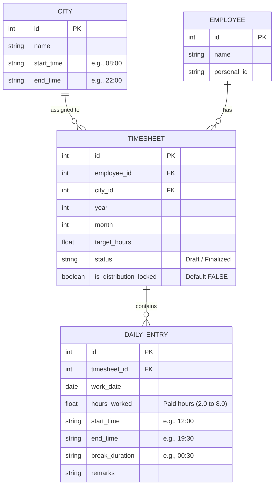

# Timesheet & Driver Shift Distribution System - Plan

This document outlines the agreed-upon requirements, rules, database schema, and solver architecture for scaling the timesheet generator into a database-backed, multi-driver shift distribution system.

> **Revision Note (Phase 2 Amendments):** This plan has been updated to incorporate all 15 amendments identified during the Phase 2 Asset Review. Changes are marked with `[AMENDED]` tags for traceability.

---

## 📋 Project Scope & Goals

The goal is to scale the current single-employee timesheet generator into a system that handles multiple drivers across different cities.

* **Target Users:** Drivers for restaurants.
* **Single-User Desktop Application:** No authentication or multi-user support required. One instance runs at a time. `[AMENDED]`
* **Scheduling Nature:** Multi-driver overlap is normal and acceptable. There is no strict requirement for exact daily hour coverage for a city (no forced sum of coverage), but the system should attempt to stagger active drivers to span the city's operational hours.
* **Distribution Execution Modes:** 
  * **Batch Mode (Ideal & Recommended):** The user adds multiple drivers to a city first, and then triggers the solver to calculate and distribute hours for all of them at once. This allows the best possible cooperative staggering. **Only timesheets with `Draft` status are included in batch runs.** `[AMENDED]`
  * **Incremental Mode:** The user enters a single driver and immediately runs the distribution solver. The system will display a warning **before execution** advising that batch execution is preferred, and **ask the user to confirm** before proceeding. If confirmed, the solver executes by reading existing schedules to stagger the new driver's shifts. `[AMENDED]`

---

## ⚡ Core Scheduling Rules & Constraints

The hour distribution solver will enforce the following parameters:

### 1. Shift Durations
* **Allowed Hours:** Only half-hour increments are allowed: `2.0, 2.5, 3.0, 3.5, 4.0, 4.5, 5.0, 5.5, 6.0, 6.5, 7.0, 7.5, 8.0`.
* All other decimals (such as `.1` or `.2`) are **completely prohibited**. `[AMENDED: Legacy .1/.2 values fully eliminated]`
* **Minimum shift:** `2.0` hours.
* **Maximum shift:** `8.0` hours.

### 2. Auto-Break Rule
* Any shift of **`6.5` hours or more** automatically triggers a **0.5-hour unpaid break**.
* This break is **not** included in the worker's target monthly working hours (i.e. it does not count toward the paid sum).
* **`target_hours` means exactly the total paid working hours the driver should accumulate.** The solver must ensure the sum of paid hours equals the target exactly. Breaks are on top of this. `[AMENDED]`
* **Impact on Timesheet Table:** 
  * If a driver is assigned `7.0` hours of work, they will show `7.0` hours worked, a `0.5`-hour break, and an elapsed duration of `7.5` hours (e.g., Start: `12:00`, End: `19:30`).

### 3. Workday Constraints
* **Max Consecutive Days:** A driver can work at most `6` consecutive days.
* **Global Cross-City Enforcement:** The 6-consecutive-day rule applies **globally across all cities**. If a driver has timesheets in multiple cities for the same month, consecutive days are counted across all of them. A driver working 6 days in Istanbul cannot work day 7 in Ankara. `[AMENDED]`
* **Weekends:** No special treatment or labeling for weekends. Saturdays and Sundays are treated exactly like weekdays. **No `"Wochenende"` label in exported documents.** `[AMENDED]`

### 4. City Hours & Shift Staggering
* Each city defines operational hours (e.g. `08:00` to `22:00`).
* All shifts must start and end within the city's operational hours.
* **Staggering Logic (Incremental/Batch):**
  * When scheduling a driver, the solver queries the database for existing driver shifts in the same city on the same day.
  * It will position the new driver's start time to minimize redundant overlaps during already well-covered times, aiming to extend or fill the coverage across the city's operational window.

### 5. Target Hours Bounds `[NEW]`
* **Minimum monthly target:** `10.0` hours.
* **Maximum monthly target:** Dynamically calculated per month using the formula:
  ```
  max_workdays(N) = floor(N / 7) × 6 + min(N mod 7, 6)
  max_hours(N)    = max_workdays(N) × 8.0
  ```
  | Days in Month | Max Workdays | Max Hours |
  |---|---|---|
  | 28 | 24 | 192.0 |
  | 29 | 25 | 200.0 |
  | 30 | 26 | 208.0 |
  | 31 | 27 | 216.0 |
* **Target hours must be a multiple of `0.5`.**

### 6. Month Restriction `[NEW]`
* Timesheets can only be created for the **current month or future months**. Past months are blocked at the input validation layer.

---

## 💾 Database Schema Design (SQLite)

We will use a local SQLite database to manage drivers, cities, and their generated timesheets.

> **`[AMENDED]` Key schema changes from original plan:**
> - `city_id` moved from `EMPLOYEE` to `TIMESHEET` (drivers can work in multiple cities)
> - `role` field removed from `EMPLOYEE` (all users are drivers)
> - `is_distribution_locked` added to `TIMESHEET` (supports manual edit workflow)
> - Uniqueness constraint: `UNIQUE(employee_id, year, month, city_id)`



**Constraints:**
* `UNIQUE(employee_id, year, month, city_id)` — One timesheet per driver per month per city. A driver may have multiple timesheets in the same month if they are in different cities.
* `FOREIGN KEY(city_id) REFERENCES CITY(id)` — City deletion is **blocked** if any timesheets reference it. User must remove associated data first. `[AMENDED]`
* `FOREIGN KEY(employee_id) REFERENCES EMPLOYEE(id)` — Employee deletion is **blocked** if any timesheets reference them. `[AMENDED]`

### Backup & Recovery `[NEW]`
* The system will provide built-in **database backup** (full SQLite file copy to a user-selected location) and **restore** (load a backup file, replacing the current database) functionality.
* Accessible from a "Tools" menu in the GUI.

---

## 🧠 Solver Architecture (Constraint Programming)

We will use **Google OR-Tools CP-SAT** to implement the solver.

### Solver Formulation
1. **Variables for Driver $w$ on Day $d$:**
   * $Active_{w,d} \in \{0, 1\}$ (whether the driver works on day $d$)
   * $Hours_{w,d} \in \{2.0, 2.5, \dots, 8.0\}$ (if active)
   * $Start_{w,d} \ge CityStart$
   * $End_{w,d} \le CityEnd$
   * $Break_{w,d} = 0.5$ if $Hours_{w,d} \ge 6.5$ else $0.0$
   * $End_{w,d} = Start_{w,d} + Hours_{w,d} + Break_{w,d}$
2. **Monthly Constraints:**
   * $\sum_d Hours_{w,d} = TargetHours_w$
   * No sequence of $Active_{w,d}$ has length $> 6$ consecutive days.
   * **Global cross-city check:** When computing consecutive days, the solver loads the driver's active days from **all** timesheets in the target month (across all cities), not just the current city. `[AMENDED]`
3. **Multi-Objective Optimization (Staggering & Ergonomics):**
   * **Staggering:** If peer drivers $P_1, P_2, \dots$ already have scheduled timeslots on day $d$, the solver reads their intervals. The objective function penalizes scheduling the new driver at times when coverage is already high, pushing the new shift into under-covered slots within the $[CityStart, CityEnd]$ window.
   * **Ergonomic Preferences (Integers):** Drivers prefer clean integer shifts. The solver will penalize half-hour shifts (i.e. `2.5, 3.5, 4.5, 5.5, 6.5, 7.5`), minimizing their occurrence unless mathematically necessary to hit the monthly target or satisfy consecutive day constraints.

### Two-Phase Solve Strategy `[NEW]`
When the solver is triggered:
1. **Phase A (Exact):** Attempt to solve with the hard constraint that paid hours sum to exactly `target_hours`.
2. **Phase B (Nearest Feasible):** If Phase A is infeasible, relax the target constraint and minimize `|Σ Hours - TargetHours|`. Present the nearest feasible result to the user:
   * Display: *"Exact target of X hours could not be achieved. Nearest feasible: Y hours. Accept?"*
   * User can **Accept** (save the Y-hour schedule) or **Reject** (return to editing inputs).

### Solver Interaction with Locked Timesheets `[NEW]`
* Timesheets with `is_distribution_locked = TRUE` are **never modified** by the solver.
* However, they are **read as fixed constraints** — their daily entries are loaded and used for staggering optimization and consecutive-day counting.

### ⚠️ Technical QA & Implementation Rules
* **Integer Scaling in CP-SAT:** Since Google OR-Tools CP-SAT is strictly integer-based, all time variables must be scaled by a factor of 2 (e.g. 1 unit = 30 minutes) to avoid floating-point constraints.
* **Target Hour Validation:** The UI/DB must validate that input `target_hours` is a multiple of `0.5`, within `[10.0, max_hours(N)]`. `[AMENDED]`
* **City Operational Span Constraint:** Daily assigned hours + breaks must not exceed the city's operational window on that day ($End_{w,d} - Start_{w,d} \le CityEnd - CityStart$).
* **Cross-Month Boundary Validation:** To prevent violating the 6-consecutive-day rule across months, the solver must query the driver's schedule for the last 6 days of the previous month. **If no previous month data exists, assume all days off.** `[AMENDED]`
* **Incremental Coverage Warnings:** The GUI should display warnings if deletions or edits create coverage gaps in a city's calendar.
* **Re-generation Confirmation:** If a timesheet already exists for a driver/month/city and the solver is triggered again, the system must prompt: *"This will replace the existing schedule. Continue?"* `[NEW]`

---

## 🖥️ Graphical User Interface (GUI) Design

The GUI will transition from a single-form generator to a multi-view management dashboard.

### 1. Core Views & CRUD Operations
* **Cities Management View:**
  * View list of registered cities.
  * Add, edit, or delete cities (including names and operational start/end hours).
  * **Deletion is blocked if the city has associated timesheets.** `[AMENDED]`
* **Drivers Management View:**
  * View list of all drivers.
  * Add, edit, or delete driver details (Name, Personal ID).
  * **Deletion is blocked if the driver has associated timesheets.** `[AMENDED]`
* **Timesheets Management View:**
  * Create new monthly timesheets for drivers (selecting city, month/year, target hours).
  * **Month/year restricted to current or future months.** `[AMENDED]`
  * Set monthly target working hours.
  * Trigger the **Hour Distribution Solver** for a single driver or in batch for all Draft-status drivers in a city.
  * Preview daily hour schedules in an editable grid table.
  * Trigger document building to export the styled Word `.docx` file (the core feature).

### 2. Post-Solver Manual Edit Workflow `[NEW]`
After the solver generates a schedule and it is displayed in the grid preview:
* The user may **manually edit** any cell (hours, start time, end time, day on/off).
* On saving a manual edit, the system prompts:
  * **"Apply changes to all workers?"** → Re-runs the solver for all Draft (non-locked) timesheets in the same city/month, treating the manually edited driver's schedule as a fixed constraint.
  * **"Lock this driver only"** → Sets `is_distribution_locked = TRUE` on the edited timesheet. Saves manual edits directly. This driver is excluded from future batch redistribution for this month/city.
* **Soft validation on manual edits:** The system warns (but does not hard-block) if:
  * Total hours deviate from the target.
  * A shift is below 2.0 or above 8.0 hours.
  * More than 6 consecutive active days exist (including cross-city).
  * Start/end times fall outside city operational hours.

### 3. Draft / Finalized Workflow `[NEW]`
* New timesheets are created with status `Draft`.
* **Finalization** is an explicit user action (a "Finalize" button on the timesheet view).
* A `Finalized` timesheet **cannot be re-solved or batch-redistributed**. To modify it, the user must first revert it to `Draft`.
* Exporting to Word is available for both Draft and Finalized timesheets.

### 4. Backup & Recovery `[NEW]`
* A **"Tools"** menu provides:
  * **Backup Database:** Copies the SQLite database file to a user-selected location.
  * **Restore Database:** Loads a backup file, replacing the current database (with confirmation prompt).

### 5. Analytical & Insights View (Future Roadmap)
* **Driver Analytics:**
  * View a summary of total hours worked over the last few months.
  * Track average shift duration, count of active shifts, and verify compliance constraints.
* **City Insights:**
  * Coverage distribution graphs (e.g. hourly occupancy heatmap showing which hours are covered by how many drivers across a day/month).
  * Identify peak operational hours vs under-staffed hours.
* **Visualization Stack:** 
  * Designed to support visual charts (e.g. using `matplotlib` integrated into the Tkinter window or using web-based charts if migrated to a web frontend).

---

## 📁 Proposed Project Structure

We will transition the single-file script into a modular project layout:

```text
excel-timesheet/
│
├── db/
│   ├── database.py         # DB connection & table initialization
│   └── models.py           # CRUD operations for Cities, Employees, Timesheets
│
├── solver/
│   ├── __init__.py
│   └── sat_solver.py       # OR-Tools CP-SAT scheduler & staggering engine
│
├── exporter/
│   ├── __init__.py
│   └── docx_exporter.py    # Generates formatted Tätigkeitsnachweis Word files
│
├── ui/
│   ├── __init__.py
│   └── main_gui.py         # Tkinter TTK desktop interface
│
├── utils/
│   └── paths.py            # Base path resolution for script vs. compiled .exe
│
├── plan.md                 # This planning document
└── generate_timesheet.py   # Main entry point
```

---

## 🧪 Verification & Testing Plan

### 1. Automated Tests
* **Database Unit Tests:** Verify adding, updating, and querying drivers, cities, and timesheets. Verify uniqueness constraint `(employee_id, year, month, city_id)`. Verify cascade-block on deletion. `[AMENDED]`
* **Solver Unit Tests:** Assert that generated hours always match targets, breaks are correctly applied, shifts remain within city hours, and the 6-consecutive-day limit is never broken — **including cross-city scenarios**. `[AMENDED]`
* **Validation Tests:** Verify that past months are rejected, target hours outside `[10.0, max_hours(N)]` are rejected, non-0.5-multiple targets are rejected. `[NEW]`

### 2. Manual Verification
* Run the generation for a test city with 3 drivers (with different targets). Check that they successfully stagger start times across the city's operational hours in the database.
* Test a driver with timesheets in **two cities** in the same month. Verify the 6-consecutive-day rule spans both. `[AMENDED]`
* Export timesheets to Word and inspect the output formatting — verify that **start times, end times, and break durations are filled in**. `[AMENDED]`
* Test manual edit workflow: edit a driver's schedule, choose "lock," verify batch re-solve skips the locked driver. `[NEW]`

---

## 🚀 Step-by-Step Incremental Implementation Guide

To prevent developer or AI confusion, the implementation is divided into isolated, sequential phases. Complete each phase and verify it before moving to the next.

### Phase 1: Database Setup & CRUD Layer
* **Task 1.1: Database Schema (`db/database.py`)**
  * Create the SQLite database file and initialize the four tables (`CITY`, `EMPLOYEE`, `TIMESHEET`, `DAILY_ENTRY`) with correct data types, primary keys, and foreign key relations.
  * `EMPLOYEE` contains only: `id`, `name`, `personal_id`. `[AMENDED: no role, no city_id]`
  * `TIMESHEET` contains: `id`, `employee_id`, `city_id`, `year`, `month`, `target_hours`, `status`, `is_distribution_locked`. `[AMENDED]`
  * Enforce `UNIQUE(employee_id, year, month, city_id)`. `[AMENDED]`
  * Enforce foreign key cascade-block on `CITY` and `EMPLOYEE` deletion. `[AMENDED]`
* **Task 1.2: CRUD Model Layer (`db/models.py`)**
  * Write clear, isolated helper functions:
    * `add_city`, `get_cities`, `update_city`, `delete_city` (with referential integrity check)
    * `add_employee`, `get_employees`, `update_employee`, `delete_employee` (with referential integrity check) `[AMENDED]`
    * `create_timesheet`, `get_timesheet_with_entries`, `save_daily_entries`, `delete_timesheet`
    * `set_distribution_lock`, `get_locked_timesheets` `[NEW]`
    * `backup_database`, `restore_database` `[NEW]`
* **Task 1.3: Verification Tests**
  * Write standard Python unit tests to insert, read, update, and delete sample cities, drivers, and timesheets to verify DB logic.
  * Test uniqueness constraint violation. `[NEW]`
  * Test cascade-block on deletion. `[NEW]`

### Phase 2: CP-SAT Hour Distribution Solver
* **Task 2.1: Unit Scale Initialization (`solver/sat_solver.py`)**
  * Set up the Google OR-Tools solver. Implement integer scaling: Convert all times where **1 unit = 30 minutes** (e.g. `2.0h` = 4 units, `8.0h` = 16 units). Reject target hours input if not a multiple of `0.5`.
* **Task 2.2: Define Variables and Bounds**
  * Define day-by-day active flags, start times, end times, and break durations. Limit start and end times to the city's operational start/end times.
  * **Allowed shift values:** `{2.0, 2.5, 3.0, 3.5, 4.0, 4.5, 5.0, 5.5, 6.0, 6.5, 7.0, 7.5, 8.0}` — 13 values only. `[AMENDED]`
* **Task 2.3: Implement Hard Constraints**
  * Add constraints: Sum of hours matches monthly target, max 6 consecutive workdays — **enforced globally across all of the driver's timesheets in the target month** `[AMENDED]` — loading previous month's boundary data from the DB (**defaulting to all-off if missing** `[AMENDED]`), and auto-break assignment (if daily hours $\ge 6.5$, break is $0.5$ hours; break shifts the end time but is not counted as paid hours).
* **Task 2.4: Implement Multi-Objective Optimization**
  * Add a penalty to the objective function for any odd shift duration values (minimizing half-hour shifts unless mathematically necessary).
  * Add a penalty for overlaps with existing timesheet shifts (which are queried from the database on a given day).
* **Task 2.5: Two-Phase Solve Strategy `[AMENDED]`**
  * **Phase A:** Solve with hard `Σ Hours = TargetHours` constraint.
  * **Phase B (if A fails):** Relax target, minimize deviation, present nearest feasible result for user acceptance or rejection.
* **Task 2.6: Solver Modes (Batch vs. Incremental)**
  * Support batch distribution (solving for multiple Draft, non-locked drivers at once) and incremental distribution (solving for one driver given other drivers' pre-scheduled slots). `[AMENDED]`
  * **Locked timesheets** (`is_distribution_locked = TRUE`) are loaded as fixed read-only constraints but never modified. `[NEW]`
* **Task 2.7: Verification Tests**
  * Write unit tests checking that target hours match, no decimal anomalies occur, break logic functions, and the 6-consecutive-day limit holds — **including cross-city scenarios**. `[AMENDED]`
  * Test the nearest-feasible fallback produces a valid result. `[NEW]`

### Phase 3: Word Document Exporter
* **Task 3.1: Exporter Integration (`exporter/docx_exporter.py`)**
  * Move the template layout styling from the legacy code into a modular class.
  * **City is sourced from the TIMESHEET's city_id (joined to CITY table), not from the employee.** `[AMENDED]`
* **Task 3.2: Grid Rendering**
  * Bind table cell values for `Arbeitsbeginn` (Start), `Arbeitsende` (End), and `Pause` (Break) to the **database-generated values from the solver** (these columns are no longer empty). `[AMENDED]`
  * Use German formatting (e.g. times as `hh:mm` and hours with decimal commas like `6,5`).
  * **Do not label weekend off-days as "Wochenende".** Off-days are simply blank. `[AMENDED]`

### Phase 4: Graphical User Interface (GUI)
* **Task 4.1: Multi-Tab Layout (`ui/main_gui.py`)**
  * Set up a Tkinter TTK dashboard with three main tabs: "Cities", "Drivers", and "Timesheets".
  * Add a **"Tools" menu** with Backup and Restore options. `[NEW]`
* **Task 4.2: CRUD Table Bindings**
  * Wire up the "Cities" and "Drivers" tabs to database models so the user can easily view, add, edit, and delete entries.
  * **Block deletion of cities/drivers that have associated timesheets.** `[AMENDED]`
* **Task 4.3: Timesheet Actions**
  * Implement timesheet creation (with **current/future month restriction** `[AMENDED]`), showing list of driver timesheets.
  * Add an action to distribute hours. If the user triggers it for a single driver, display a warning popup recommending batch mode, **asking for confirmation before proceeding**. `[AMENDED]`
  * Add a button for batch distribution for all **Draft, non-locked** drivers in a city. `[AMENDED]`
  * If re-generating an existing timesheet, **prompt confirmation** before overwriting. `[NEW]`
  * Implement the Word Export button triggering document generation.
* **Task 4.4: Post-Solver Manual Edit Grid `[NEW]`**
  * After solver runs, display an **editable grid** with daily entries.
  * On manual edit + save, prompt: "Apply to all workers?" or "Lock this driver only?"
  * Implement soft validation warnings for constraint violations.
* **Task 4.5: Draft / Finalize Workflow `[NEW]`**
  * Add a "Finalize" button that changes status to `Finalized`.
  * Add a "Revert to Draft" button for finalized timesheets.
  * Prevent solver re-runs on finalized timesheets.
* **Task 4.6: Main Entry Point (`generate_timesheet.py`)**
  * Update the main script to initialize the database and boot up the Tkinter dashboard.

### Phase 5: Future Visual Analytics & Statistics
* **Task 5.1: Matplotlib Dashboard Integration**
  * Create an "Analytics" tab in the GUI.
* **Task 5.2: Driver Statistics**
  * Render bar/line charts showing historical monthly worked hours for selected drivers.
* **Task 5.3: City Coverage Heatmap**
  * Display a visual daily heatmap showing driver coverage distribution across a city's operational hours.

### Phase 6: Windows Executable Compilation
* **Task 6.1: Define Base Path Utility (`utils/paths.py`)**
  * To ensure the SQLite database file resolves to the same directory as the executable:
    ```python
    import os
    import sys

    def get_base_directory():
        if getattr(sys, 'frozen', False):
            # Running as a compiled .exe; use directory of the executable
            return os.path.dirname(sys.executable)
        else:
            # Running as a script; use the project root directory
            return os.path.dirname(os.path.dirname(os.path.abspath(__file__)))

    DB_PATH = os.path.join(get_base_directory(), "timesheets.db")
    ```
* **Task 6.2: Configure PyInstaller Build Command**
  * Since Google OR-Tools contains native C++ binaries, they must be collected. Configure the compilation command to bundle all required packages:
    ```bash
    pyinstaller --onefile --windowed --name="TimesheetSystem" --collect-all ortools generate_timesheet.py
    ```
* **Task 6.3: Verification of Executable**
  * Build the executable, run it from another directory, and verify that the database file `timesheets.db` is created and read correctly right next to the `.exe` file.
